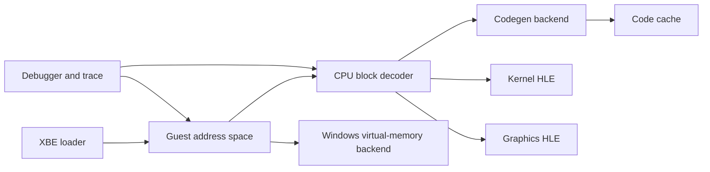

# Exbawks

Exbawks is a Rust research emulator for the original Xbox.

The project targets modern Windows 11 on x86-64. It uses `iced-x86` for guest x86 decoding, analysis, encoding, and planned direct rewriting.

Exbawks uses high-level emulation for kernel and graphics interfaces. It does not distribute Microsoft software, keys, games, firmware, or console data.

> [!IMPORTANT]
> Exbawks is a development scaffold. It does not execute commercial titles yet.

## Current scope

The repository already provides these foundations:

- A checked XBE parser with retail and debug address decoding.
- A 32-bit guest address model with a one-million-entry page table.
- A software physical-memory backend with aliases and page permissions.
- An `iced-x86` basic-block decoder and disassembler.
- A direct-rewrite translation planner and code-cache model.
- Kernel HLE and graphics HLE interfaces.
- A Windows placeholder and section-view wrapper.
- A command-line tool for host checks, XBE inspection, decoding, and boot planning.
- Synthetic tests that require no copyrighted data.

## Architecture



The first codegen backend uses direct x86-to-x64 rewriting. A later backend can lower guest operations through Cranelift.

The core memory design uses one pagefile-backed physical RAM section. Multiple virtual views can expose coherent guest aliases.

See [the documentation index](docs/README.md), [the architecture document](docs/architecture.md), and [the memory design](docs/memory.md).

## Requirements

Use these tools on the development host:

- Windows 11 on x86-64.
- Visual Studio 2022 Build Tools with the MSVC C++ workload.
- Rust 1.97.1 through `rustup`.
- PowerShell 7 or Windows PowerShell 5.1.

The pure logic crates also compile on non-Windows hosts. The emulator runtime remains Windows-first.

## Start

```powershell
.\scripts\bootstrap.ps1
cargo xtask check
cargo exbawks doctor
```

Inspect an XBE that you legally obtained:

```powershell
cargo exbawks inspect C:\path\to\default.xbe
```

Decode a small 32-bit x86 block:

```powershell
cargo exbawks decode --ip 0x00010000 --hex "8B 01 83 C0 01 C3"
```

Build an initial boot plan:

```powershell
cargo exbawks plan C:\path\to\default.xbe
```

## Repository map

| Path | Purpose |
| --- | --- |
| `apps/exbawks-cli` | Command-line frontend. |
| `crates/exbawks-core` | Emulator composition and boot flow. |
| `crates/exbawks-cpu` | Guest CPU state and block decoding. |
| `crates/exbawks-jit` | Translation plans, backends, and code cache. |
| `crates/exbawks-memory` | Guest mappings, page metadata, and software RAM. |
| `crates/exbawks-platform` | Windows host capabilities and virtual-memory calls. |
| `crates/exbawks-xbe` | XBE parsing and validation. |
| `crates/exbawks-kernel` | Kernel export registry and HLE dispatch. |
| `crates/exbawks-gpu` | Graphics command interface and null backend. |
| `crates/exbawks-debug` | Breakpoints and structured trace events. |
| `crates/exbawks-types` | Shared address and execution types. |
| `docs` | Architecture, ADRs, runbooks, and task plans. |
| `xtask` | Repository quality commands. |

## Near-term milestones

1. Complete sparse Windows arena mapping with placeholder splitting.
2. Emit executable code for a safe register-only instruction subset.
3. Add fault-site metadata and vectored exception redirection.
4. Resolve and patch the XBE kernel thunk table.
5. Implement thread, object, memory, and file kernel exports.
6. Add a graphics frontend for Xbox D3D calls and push buffers.
7. Run a synthetic XBE through the first HLE call.

See [the task board](docs/task-board.md) for issue-sized work and acceptance criteria.

See [the coding-agent handoff](docs/agent-handoff.md) before implementation work.

## Development rules

Read [AGENTS.md](AGENTS.md) before automated changes.

Run these commands before each pull request:

```powershell
python scripts/static-validate.py
cargo xtask check
```

Read [the validation report](VALIDATION.md) for checked and open validation gates.

Unsafe code belongs only in narrowly scoped host and code-emission modules. Each unsafe block must state its local invariant.

## Legal status

Exbawks is not affiliated with Microsoft.

Do not commit copyrighted Xbox software, keys, BIOS images, dashboard files, game files, or derived proprietary data.

See [the legal document](docs/legal.md).

## License

Exbawks uses the MIT license or the Apache License 2.0, at your option.
